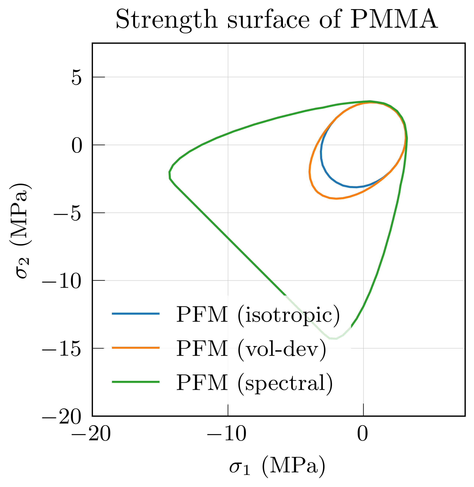
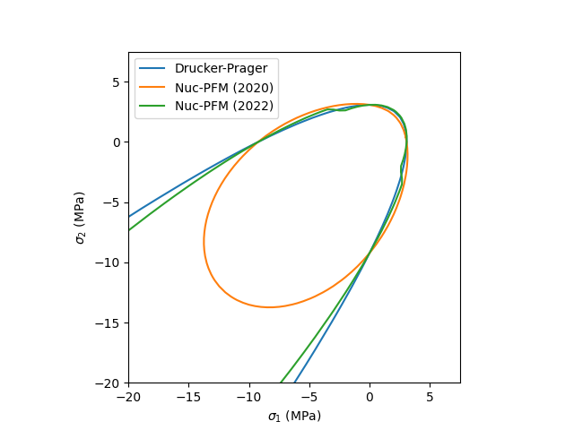
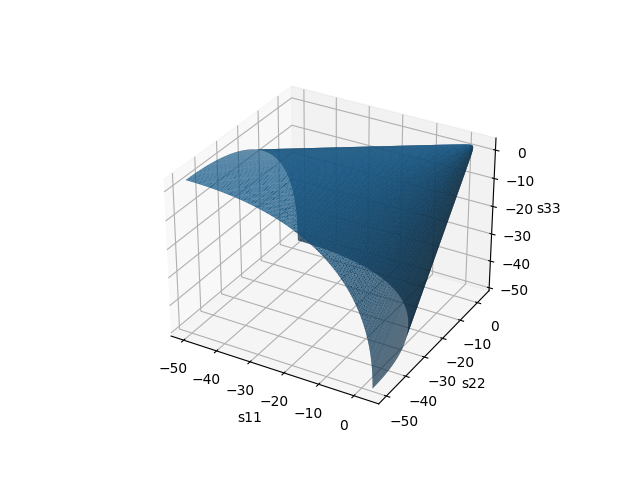

# my-vis

my visualization scripts

## plots library

### strength
> plot strength surface of various type given material properties, including Von Mises, Drucker-Prager, phase field model with no split, V-D split, and spectral split, nucleation phase field models (Kumar et al. 2020 and 2022)

For example, plot various type of strength surface of PMMA

* 2D contours
  

* 3D isosurface (Drucker-Prager type)
  

The contour line (in 2D) and vertices and faces of isosurface (in 3D) can be output to csv with option `save=True`.
