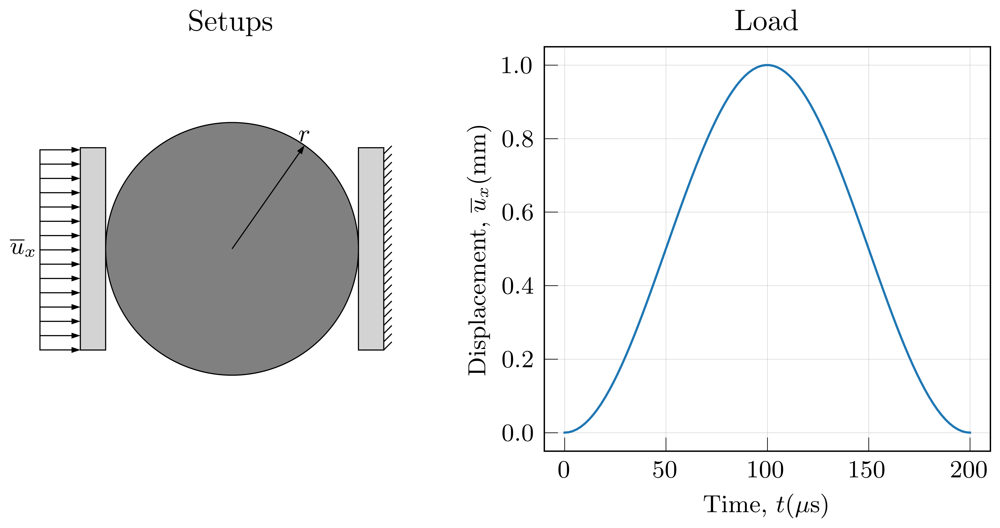
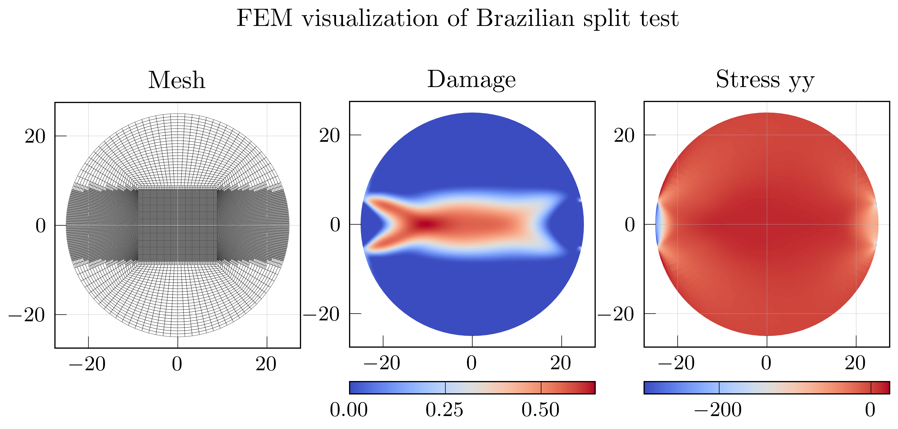
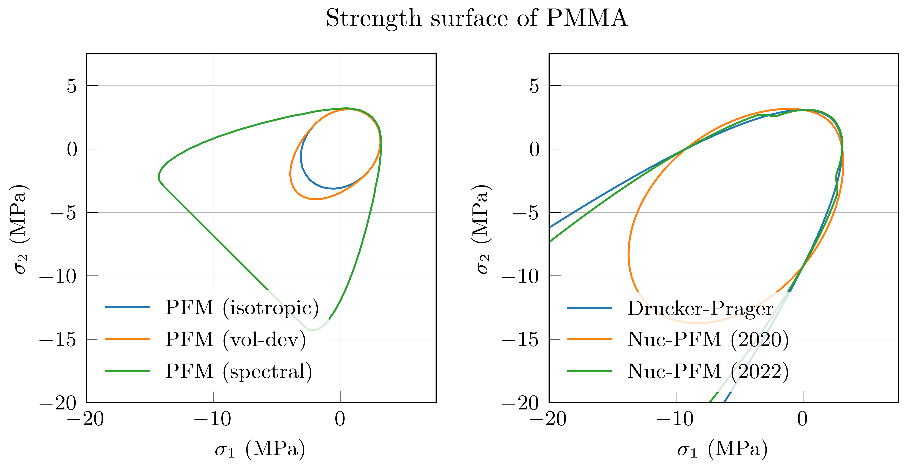

# CM-VIS

My computational mechanics visualization scripts

## Requirements
* numpy
* re
* scipy
* skimage
* matplotlib
* netCDF4

## Gallery

### FEM: schematic
> plot schematics of simulation setups
> see `./app/brz_scheme.py`

### FEM: results
> plot mesh, nodal variable and elemental variable on tri and quad mesh from FEM result files.
> see `./app/brz_post.py`

### Strength surface
> plot strength surface of various type given material properties, including Von Mises, Drucker-Prager, phase field model with no split, V-D split, and spectral split, nucleation phase field models (Kumar et al. [2020](https://doi.org/10.1016/j.jmps.2020.104027) and [2022](https://doi.org/10.1007/s10704-022-00653-z)).
> see `./app/ss_pmma.py`

For example, plot various type of strength surface of PMMA

* 2D contours
  

* 3D isosurface
  

The contour line (in 2D) and vertices and faces of isosurface (in 3D) can be output to csv with option `save=True`.
