# CM-VIS: Computational Mechanics Visualization Tools

[](https://www.python.org/downloads/)
[](LICENSE)
[](setup.py)

A comprehensive Python package for creating publication-quality visualizations in computational mechanics applications. CM-VIS provides tools for schematic diagram creation, finite element analysis visualization, strength surface plotting, and 3D data processing.

## Features

- **2D/3D Schematic Diagrams**: Create technical drawings with arrows, annotations, and boundary conditions
- **FEM Visualization**: Plot mesh, nodal variables, and elemental variables from simulation results
- **Strength Surface Analysis**: Generate and visualize material failure criteria
- **3D Data Processing**: Handle voxel data and create 3D surface plots
- **Publication Styles**: Built-in matplotlib styles for consistent scientific figures
- **Crack Analysis**: Tools for crack tip trajectory analysis and visualization

## Installation

### From GitHub (Recommended)
```bash
pip install git+https://github.com/lyyc199586/cm-vis.git
```

### Development Installation
```bash
git clone https://github.com/lyyc199586/cm-vis.git
cd cm-vis
pip install -e .
```

## Requirements

### Core Dependencies
- `numpy >= 1.20`
- `matplotlib >= 3.5`
- `scipy >= 1.7`

### Optional Dependencies
- `netCDF4` - For Exodus file reading (FEM results)
- `scikit-image` - For advanced image processing and strength surfaces
- `s3dlib` - For 3D surface visualization
- `pandas` - For data manipulation

## Gallery

### 2D Schematic Diagrams
Create technical drawings for papers and presentations with professional styling.

#### Discrete crack vs Phase field model

<div style="display: flex; gap: 10px;">
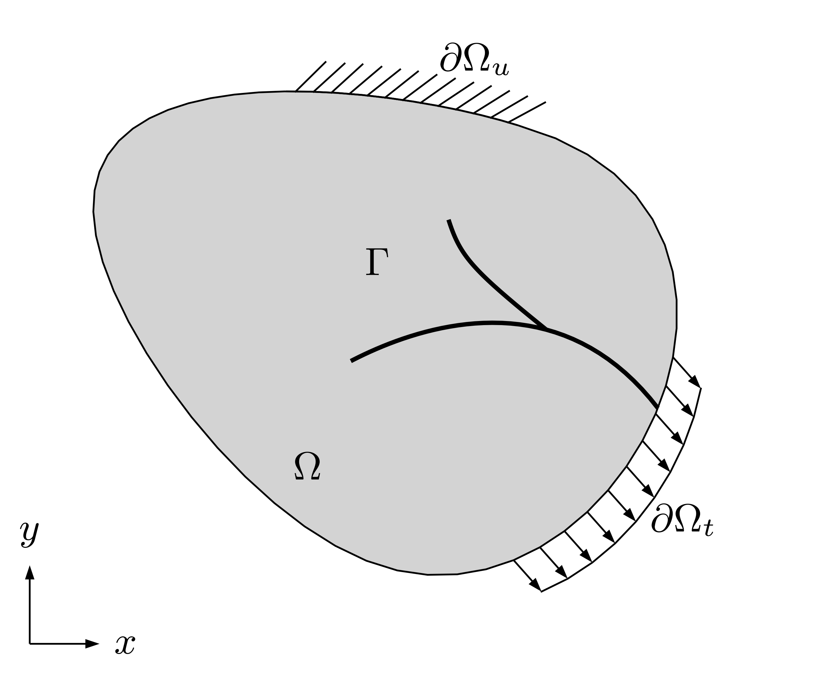
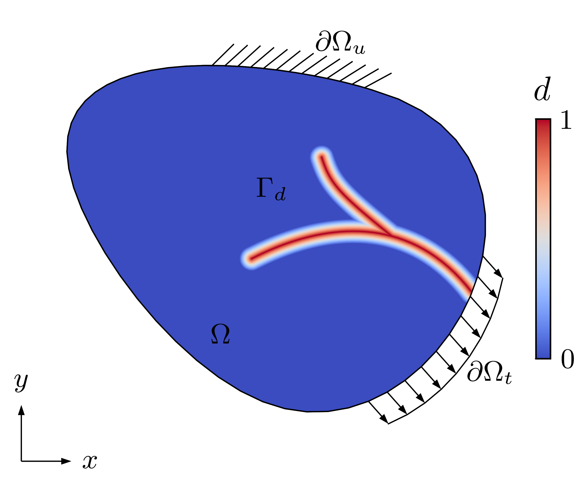
</div>

#### Brazilian Test Setup
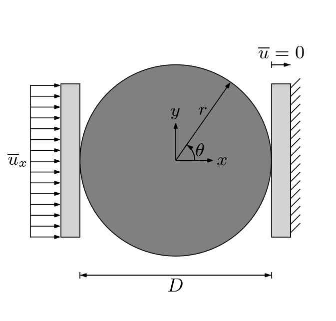

### 3D Visualizations

#### 3D Boundary Conditions
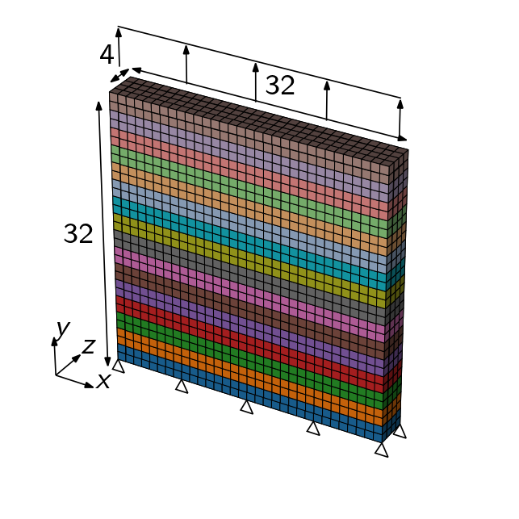

#### Voxel image and contourf

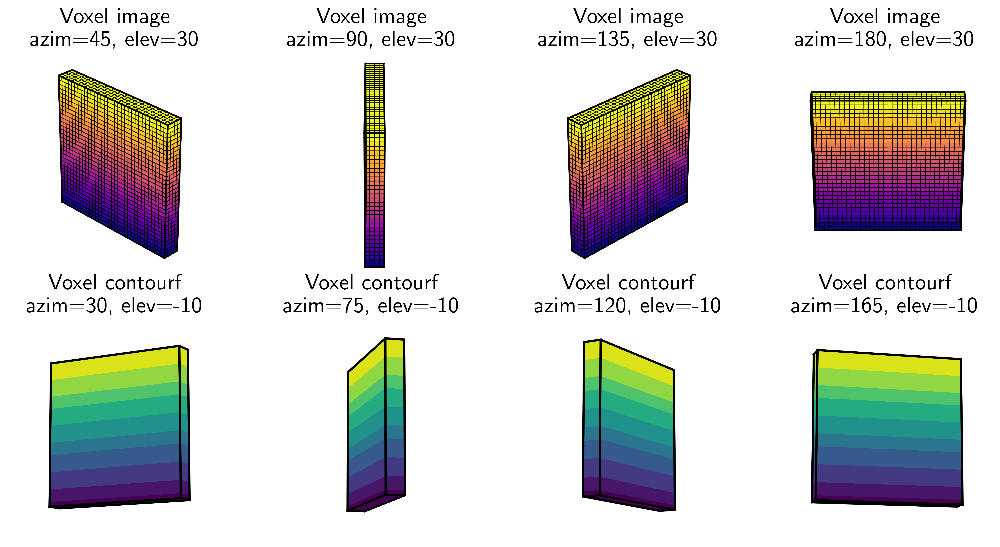
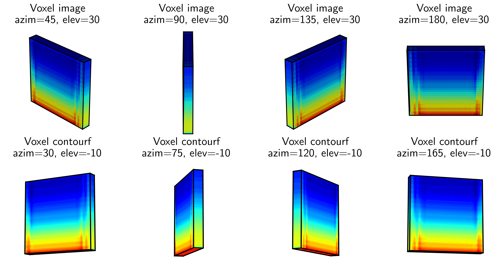

### FEM Post-Processing

#### Brazilian Test Results
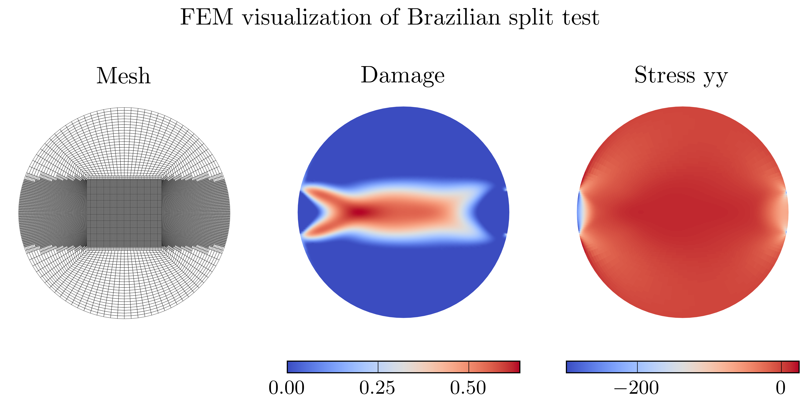


### Flowcharts and Diagrams

#### Process Flow Visualization

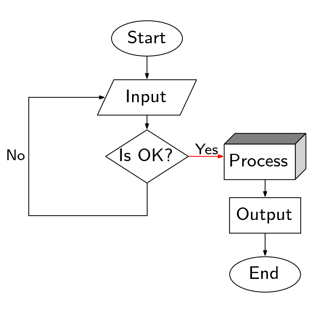
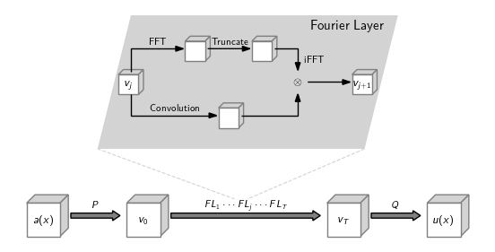

*Algorithmic flowcharts and process diagrams*

### Styling Options

#### Styles

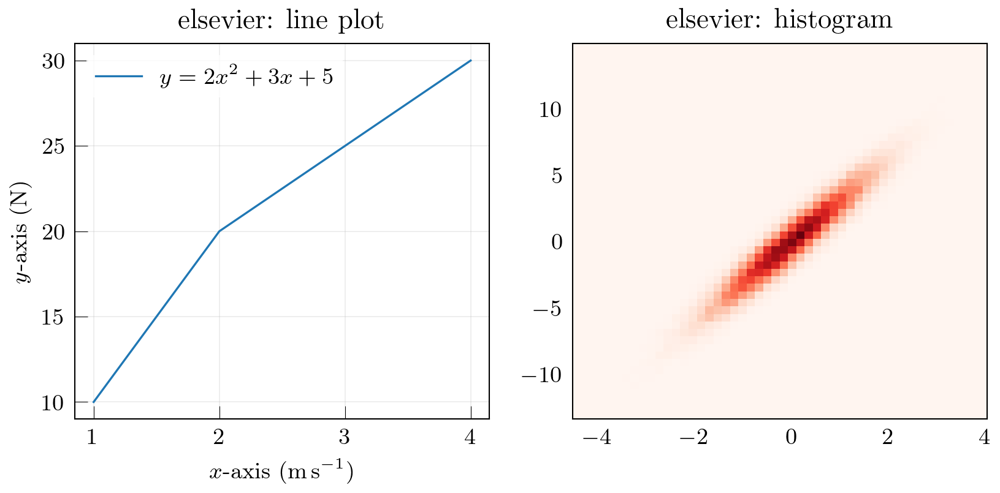
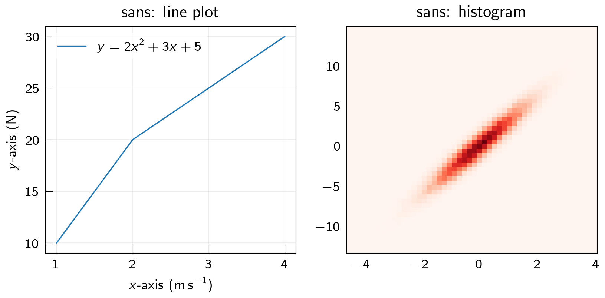


#### Custom Axis Formatting
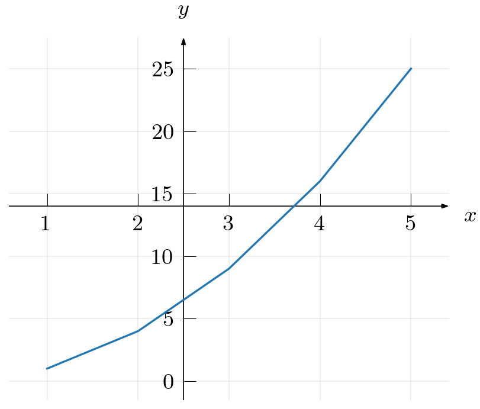


